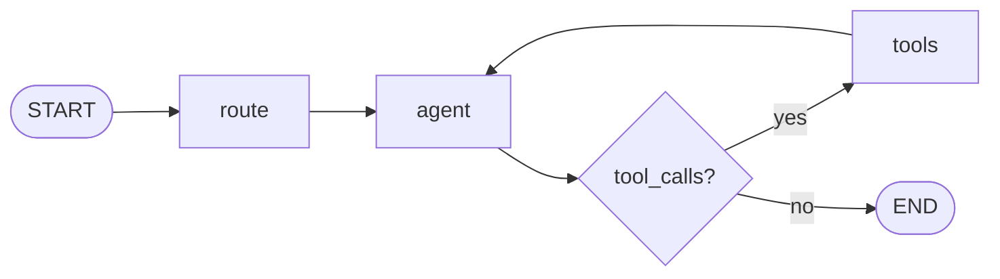

# Kamiu Agent

> Teacher assistant: a conversation Agent built with **LangGraph** and **FastAPI**, decoupled from Django. Supports multi-turn chat, tool calls, and thinking mode (planned: data lookup, subject knowledge).


---

## Features

- **LangGraph orchestration**: route → Agent (LLM + bound tools) → conditional edge (execute tools and loop back when `tool_calls` present).
- **Dual API modes**: non-streaming `POST /api/chat` and streaming SSE `POST /api/chat/stream`, same graph logic.
- **Thinking mode**: optional `enable_thinking` for models that support reasoning chains (e.g. deepseek-v3.2).
- **Ready to run**: built-in test UI (multi-turn chat), health check, CORS; config loaded from `config/*.env`.

---

## Architecture

The conversation graph is defined in `graph/graph.py`. The flow branches on whether the last message has `tool_calls`.



| Node | Description |
|------|-------------|
| **route** | Router (placeholder; passes through to agent). |
| **agent** | Calls LLM with `bind_tools`; may return tool_calls or final reply; in thinking mode, may sample reasoning when there are no tool_calls. |
| **tools** | Runs `ToolNode(tools_list)` (e.g. `get_current_time`); results are written to state and control returns to agent. |

---

## Project structure

```
kamiu_agent/
├── app.py                 # FastAPI app entry
├── run.sh                 # Run script (default port 8002)
├── requirements.txt
├── config/                # Env config
│   ├── llm.env           # LLM (DASHSCOPE_API_KEY, LLM_MODEL, etc.)
│   └── database.env      # Database (reserved)
├── core/                  # Core logic
│   ├── config.py         # Settings (pydantic-settings)
│   ├── agent.py          # Agent invocation
│   ├── deps.py           # Dependency injection
│   ├── llm/              # LLM client and Chat
│   └── schemas/          # Request/response models
├── graph/                 # LangGraph
│   ├── state.py          # Graph state
│   ├── nodes.py          # Nodes (route, agent)
│   └── graph.py          # Graph build and compile
├── routers/               # API routes
│   ├── health.py         # GET /health
│   └── assistant/        # /api/chat, /api/chat/stream
├── tools/                 # Tools (e.g. get_current_time)
├── prompts/               # Prompts
├── docs/
│   └── api.md            # API reference
├── scripts/               # Examples and tests
│   ├── examples/         # e.g. chat_qwen_think.py
│   └── test/             # API tests
├── static/                # Test frontend
│   └── index.html        # Multi-turn chat page
└── utils/
```

---

## Quick start

### Requirements

- Python 3.10+
- Optional: Alibaba DashScope API key (for qwen and similar models).

### Install and run

```bash
# Clone and enter project
cd kamiu_agent

# Install dependencies
pip install -r requirements.txt

# Config: set in config/llm.env (example)
# DASHSCOPE_API_KEY=sk-xxx
# LLM_MODEL=qwen-plus
# ENABLE_THINKING_DEFAULT=false

# Start server (default http://0.0.0.0:8002)
./run.sh
# or
uvicorn app:app --host 0.0.0.0 --port 8002 --reload
```

### Verify

| Purpose | How |
|--------|-----|
| Health check | `GET http://localhost:8002/health` |
| Multi-turn chat UI | Open `http://localhost:8002/` or `http://localhost:8002/static/index.html` in a browser |
| Non-streaming chat | `POST http://localhost:8002/api/chat` with body `{"message": "Hello", "history": []}` |
| Streaming chat | `POST http://localhost:8002/api/chat/stream` with same body; SSE events: `reasoning` \| `content` \| `usage` \| `done` |

Request/response details: [docs/api.md](docs/api.md).

---

## Configuration

Settings are loaded from `config/*.env` by `core/config.py` (`Settings`):

| Variable | Description | Default |
|----------|-------------|---------|
| `DASHSCOPE_API_KEY` | Alibaba DashScope API key | Required for qwen |
| `LLM_MODEL` | Model name | `qwen-plus` |
| `ENABLE_THINKING_DEFAULT` | Default thinking mode | `false` |

---

## Contributing

1. Fork the repository.  
2. Create a feature branch (e.g. `feat/xxx`).  
3. Commit and push to the branch.  
4. Open a Pull Request.

---

## License

See the license file in the project root.
