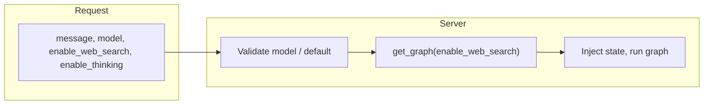

# Kamiu Agent

> Teacher assistant: a conversation Agent built with **LangGraph** and **FastAPI**, decoupled from Django. Supports multi-turn chat, tool calls, and thinking mode (planned: data lookup, subject knowledge).


---

## Features

- **LangGraph orchestration**: route → schema linking (relevant schema selection) → Agent (LLM + dynamic tool binding) → conditional edge (execute tools and loop back when `tool_calls` present).
- **Dual API modes**: non-streaming `POST /api/chat` and streaming SSE `POST /api/chat/stream`, same graph logic.
- **Thinking mode**: optional `enable_thinking` for models that support reasoning chains (e.g. deepseek-v3.2).
- **Text2SQL (read-only)**: automatically routes DB questions, performs schema linking first, then generates read-only SQL and executes safely.
- **Auto repair & retry**: on SQL errors, repairs and retries up to 3 times; UI shows each attempt’s SQL and result.
- **Frontend UX**: assistant output rendered as Markdown; executed SQL and query results are shown in dedicated blocks.
- **Ready to run**: built-in test UI (multi-turn chat), health check, CORS; config loaded from `config/*.env`.

---

## Architecture

### Request to graph

Requests carry `message`, optional `model`, `enable_web_search`, and `enable_thinking`. The server validates `model`, injects state, and runs the graph. Whether to query DB is decided automatically by routing.



### Graph execution

The conversation graph is defined in `graph/graph.py`: route decides whether DB is needed; if yes, schema linking runs first; then agent runs. If the LLM returns `tool_calls`, run tools and loop back to agent (possibly multiple times), otherwise end.

```mermaid
flowchart LR
    START([START]) --> route[route\nrules + LLM(JSON) routing]
    route --> need_db{enable_db_query?}
    need_db -->|yes| schema_link[schema_link\n2-stage: top-k candidates + LLM refine]
    need_db -->|no| agent[agent]
    schema_link --> agent[agent]
    agent --> has_tool_calls{Last message\nhas tool_calls?}
    has_tool_calls -->|yes| tools[tools]
    has_tool_calls -->|no| END([END])
    tools --> agent
```

| Node | Description |
|------|-------------|
| **route** | Intent routing (rules + LLM JSON) producing `enable_db_query/force_db_query`. |
| **schema_link** | Schema linking: selects relevant tables/fields (lexical top-k + LLM refine) into `schema_link`. |
| **agent** | Calls LLM with the request’s **model**; dynamically binds tools; when `force_db_query=true`, must verify via DB tools (no guessing). |
| **tools** | Executes tools: `get_current_time`, `get_db_schema`, `execute_readonly_sql`, `repair_sql`, `web_search`. SQL failures are auto-repaired and retried (up to 3). Streaming UI receives `exec`/`exec_result`. |

---

## Project structure

```
kamiu_agent/
├── app.py                 # FastAPI app entry
├── run.sh                 # Run script (default port 8002)
├── requirements.txt
├── config/                # Env config
│   ├── llm.env           # LLM (DASHSCOPE_API_KEY, LLM_MODEL, etc.)
│   └── database.env      # Database (reserved)
├── core/                  # Core logic
│   ├── config.py         # Settings (pydantic-settings)
│   ├── agent.py          # Agent invocation
│   ├── deps.py           # Dependency injection
│   ├── llm/              # LLM client and Chat
│   └── schemas/          # Request/response models
├── graph/                 # LangGraph
│   ├── state.py          # Graph state
│   ├── intent_router.py  # LLM intent routing (JSON)
│   ├── schema_link.py    # Schema linking (2-stage)
│   ├── nodes.py          # Nodes (route, agent)
│   └── graph.py          # Graph build and compile
├── routers/               # API routes
│   ├── health.py         # GET /health
│   └── assistant/        # /api/chat, /api/chat/stream
├── tools/                 # Tools (e.g. get_current_time)
├── prompts/               # Prompts
├── docs/
│   └── api.md            # API reference
├── scripts/               # Examples and tests
│   ├── examples/         # e.g. chat_qwen_think.py
│   └── test/             # API tests
├── static/                # Test frontend
│   └── index.html        # Multi-turn chat page
└── utils/
```

---

## Quick start

### Requirements

- Python 3.10+
- Optional: Alibaba DashScope API key (for qwen and similar models).

### Install and run

```bash
# Clone and enter project
cd kamiu_agent

# Install dependencies
pip install -r requirements.txt

# Config: set in config/llm.env (example)
# DASHSCOPE_API_KEY=sk-xxx
# LLM_MODEL=qwen-plus
# ENABLE_THINKING_DEFAULT=false

# Start server (default http://0.0.0.0:8002)
./run.sh
# or
uvicorn app:app --host 0.0.0.0 --port 8002 --reload
```

### Verify

| Purpose | How |
|--------|-----|
| Health check | `GET http://localhost:8002/health` |
| Multi-turn chat UI | Open `http://localhost:8002/` or `http://localhost:8002/static/index.html` in a browser |
| Non-streaming chat | `POST http://localhost:8002/api/chat` with body `{"message": "Hello", "history": []}` |
| Streaming chat | `POST http://localhost:8002/api/chat/stream` with same body; SSE events: `reasoning` \| `content` \| `exec` \| `exec_result` \| `done` |

Request/response details: [docs/api.md](docs/api.md).

---

## Configuration

Settings are loaded from `config/*.env` by `core/config.py` (`Settings`):

| Variable | Description | Default |
|----------|-------------|---------|
| `DASHSCOPE_API_KEY` | Alibaba DashScope API key | Required for qwen |
| `LLM_MODEL` | Model name | `qwen-plus` |
| `ENABLE_THINKING_DEFAULT` | Default thinking mode | `false` |
| `DB_HOST/DB_PORT/DB_USER/DB_PASSWORD/DB_NAME` | MySQL connection (read-only SQL) | see `config/database.env` |

### Database safety (important)

- Code-level: `execute_readonly_sql` enforces read-only SQL (only `SELECT/SHOW/DESCRIBE/EXPLAIN`), rejects multi-statements and dangerous keywords/functions, and adds a default `LIMIT` for `SELECT` to avoid heavy queries.
- Recommended: use a **read-only DB account** (SELECT-only) as a second layer of defense.

---

## Contributing

1. Fork the repository.  
2. Create a feature branch (e.g. `feat/xxx`).  
3. Commit and push to the branch.  
4. Open a Pull Request.

---

## License

See the license file in the project root.
