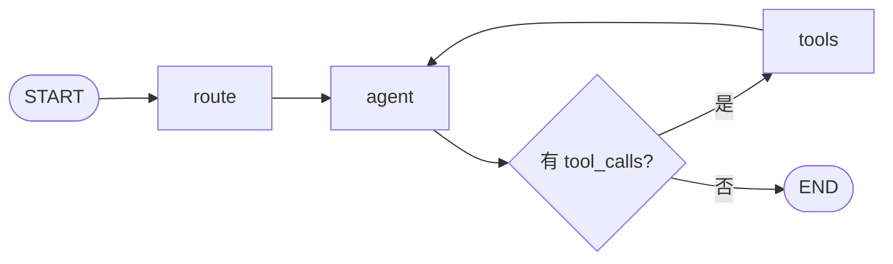

# Kamiu Agent

> 教师智能助手：基于 LangGraph + FastAPI 的对话 Agent，与 Django 解耦，支持多轮对话、工具调用与思考模式（规划：查数、学科知识）。

---

## ✨ 特性

- **LangGraph 编排**：路由 → Agent（LLM + 工具绑定）→ 条件边（有 tool_calls 则执行工具再回到 Agent）
- **双模式接口**：非流式 `POST /api/chat`、流式 SSE `POST /api/chat/stream`，同一图逻辑
- **思考模式**：可选 `enable_thinking`，兼容支持推理链的模型（如 deepseek-v3.2）
- **开箱即用**：内置测试前端（多轮对话）、健康检查、CORS，配置从 `config/*.env` 加载

---

## 🏗 架构概览

对话图由 `graph/graph.py` 定义，根据最后一条消息是否包含 `tool_calls` 决定是否执行工具并循环。



| 节点 | 说明 |
|------|------|
| **route** | 路由节点（占位，直接进入 agent） |
| **agent** | 调用 LLM（`bind_tools`），可返回 tool_calls 或最终回复；思考模式下无 tool_calls 时会补采 reasoning |
| **tools** | 执行 `ToolNode(tools_list)`（如 `get_current_time`），结果写回 state 后回到 agent |

---

## 📁 项目结构

```
kamiu_agent/
├── app.py                 # FastAPI 入口
├── run.sh                 # 启动脚本（默认端口 8002）
├── requirements.txt
├── config/                # 环境配置
│   ├── llm.env           # 大模型（DASHSCOPE_API_KEY、LLM_MODEL 等）
│   └── database.env      # 数据库（预留）
├── core/                  # 核心逻辑
│   ├── config.py         # 配置加载（pydantic-settings）
│   ├── agent.py          # Agent 调用封装
│   ├── deps.py           # 依赖注入
│   ├── llm/              # LLM 客户端与 Chat
│   └── schemas/          # 请求/响应模型
├── graph/                 # LangGraph 图
│   ├── state.py          # 图状态
│   ├── nodes.py          # 节点实现（route、agent）
│   └── graph.py          # 图构建与编译
├── routers/               # API 路由
│   ├── health.py         # GET /health
│   └── assistant/        # /api/chat、/api/chat/stream
├── tools/                 # 工具（如 get_current_time）
├── prompts/               # 提示词
├── docs/                  # 文档
│   └── api.md            # API 详细说明
├── scripts/               # 示例与测试
│   ├── examples/         # 如 chat_qwen_think.py
│   └── test/             # API 测试
├── static/                # 测试前端
│   └── index.html        # 多轮对话页
└── utils/
```

---

## 🚀 快速开始

### 环境要求

- Python 3.10+
- 可选：阿里云 DashScope API Key（用于 qwen 等模型）

### 安装与运行

```bash
# 克隆后进入项目目录
cd kamiu_agent

# 安装依赖
pip install -r requirements.txt

# 配置：在 config/llm.env 中设置（示例）
# DASHSCOPE_API_KEY=sk-xxx
# LLM_MODEL=qwen-plus
# ENABLE_THINKING_DEFAULT=false

# 启动服务（默认 http://0.0.0.0:8002）
./run.sh
# 或
uvicorn app:app --host 0.0.0.0 --port 8002 --reload
```

### 验证

| 用途 | 方式 |
|------|------|
| 健康检查 | `GET http://localhost:8002/health` |
| 多轮对话测试 | 浏览器打开 `http://localhost:8002/` 或 `http://localhost:8002/static/index.html` |
| 非流式对话 | `POST http://localhost:8002/api/chat`，body: `{"message": "你好", "history": []}` |
| 流式对话 | `POST http://localhost:8002/api/chat/stream`，同上 body，SSE 事件：`reasoning` \| `content` \| `usage` \| `done` |

API 请求/响应字段详见 [docs/api.md](docs/api.md)。

---

## ⚙️ 配置说明

配置来自 `config/*.env`，由 `core/config.py` 中的 `Settings` 加载：

| 变量 | 说明 | 默认 |
|------|------|------|
| `DASHSCOPE_API_KEY` | 阿里云 DashScope API Key | 必填（qwen 等） |
| `LLM_MODEL` | 模型名称 | `qwen-plus` |
| `ENABLE_THINKING_DEFAULT` | 默认是否开启思考模式 | `false` |

---

## 🤝 参与贡献

1. Fork 本仓库  
2. 新建功能分支（如 `feat/xxx`）  
3. 提交代码并推送到分支  
4. 提交 Pull Request  

---

## 📄 许可

按项目根目录许可文件为准。
